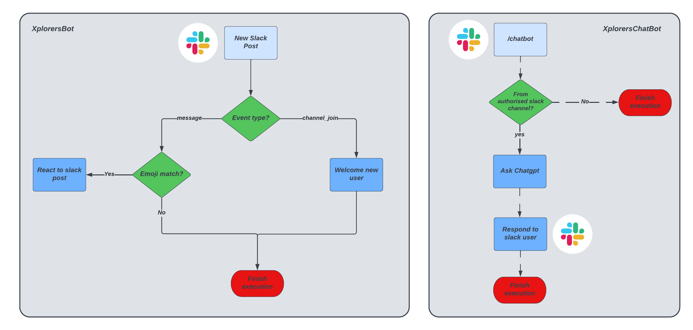

## Xplorers Bot
Slack bot written in Golang to make Xplorers Slack community fun and interactive :)

## Architecture Diagram


## Workflow Diagram


## AWS Resources

An Amazon [free tier](https://aws.amazon.com/free) account is required to deploy the infrastructure which includes,

* HTTP API - Receives slack request and triggers lambda with the payload.
* Go Lambda - Processes event sent from the API Gateway and responds to slack appropriately.
* Cloudwatch log group - Stores lambda invocation logs.
* IAM Role - IAM Role with policies necessary for lambda.
* Lambda resource policy - Allow API Gateway to invoke lambda.

## Features

There are a million ways to use a slack bot make Slack fun. Current features of XplorersBot are,

* ***Welcome a new slack user*** - When a user joins a slack channel, XplorersBot crafts a welcome message and posts in the channel to welcome the user.
* ***React to slack posts with emojis*** - With every slack post, XplorersBot checks the text for any keyword matches and reacts to the post with appropriate emoji's. For example, for text `This is a kubernetes environment`, XplorersBot will react to the post with `kubernetes` emoji.

> As every slack organisation can have custom emojis added, the function `GetKeyWordsMap` in `internal/xplorersbot/slack_emoji.go` will need to be adjusted accordingly to fit your slack emoji set.

## PreRequisites

Install the following dependencies,

* [Go](https://go.dev/doc/install)
* [AWS CLI](https://docs.aws.amazon.com/cli/latest/userguide/getting-started-install.html)
* [Make](https://www.gnu.org/software/make/)

## Install Go Dependencies

Install go dependencies from `go.mod`,

```
go mod tidy
```

## Unit tests

Run go unit tests and generate a coverage report,

```
make test
```

## Populate SSM Parameters

The following SSM Parameters defined in `settings/defaults.conf` are required by XplorersBot,

* ***ARTIFACTS_BUCKET_SSM_PATH*** (/xplorers/artifacts/bucket/name) - Bucket to store artifacts
* ***SLACK_OAUTH_TOKEN_SSM_PATH*** (/xplorers/slack/bot/oauth/token) - Token used to interact with Slack.
* ***SENTRY_DSN_SSM_PATH*** (/xplorers/slack/bot/sentry/dsn) - Initialize Sentry with DSN

Populate the above in your AWS Account before deploying XplorersBot.

## Deploy XplorersBot to AWS

Build go binary and deploy to AWS,

```
make deploy-xplorers-bot
```

The output section of cloudformation stack deployed contains the API Gateway endpoint required to setup Slack in the next step.

## Slack setup

A Slack app event subscription with a bot user is required for Slack to send events to the API gateway endpoint.

After deploying the application to AWS, refer to the documentation on [Slack Event Subscriptions](https://api.slack.com/events-api) to configure a [slack app](https://api.slack.com/authentication/basics) with an event subscription.

The following scopes are required for bot user to interact with Slack,
* app_mentions:read - View messages that directly mention the bot user
* chat:write - Send messages as bot user
* reactions:write - Add and edit emoji reactions
* channels:history - View messages and other content in public channels that bot user has been added to

## CI/CD with Github Actions

Xplorersbot uses Github Actions for its CI/CD pipeline. With every push from every branch, unit tests will run and the workflow is defined in `.github/workflows/run-tests.yml`.

With every pull request merge to `main` branch, actions will automatically update the production environment by deploying to AWS (workflow `.github/workflows/deploy-to-aws.yml`)

## Release tags

With the help of github actions and release drafter tool, a new release tag is created on every merge to `main`.
